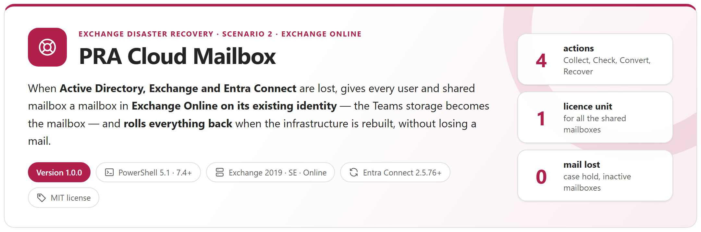
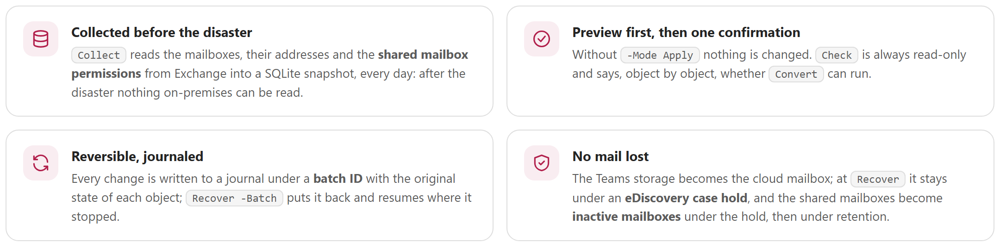
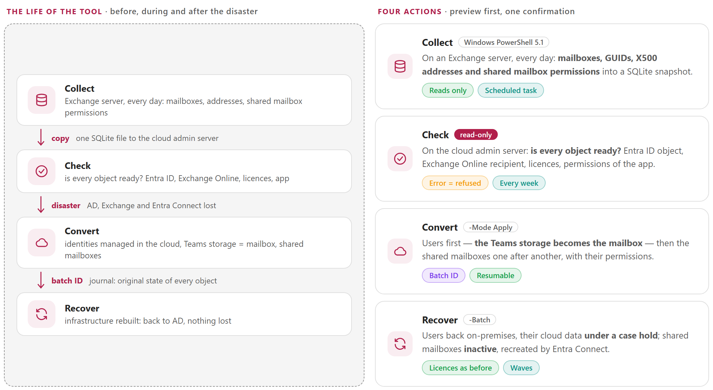
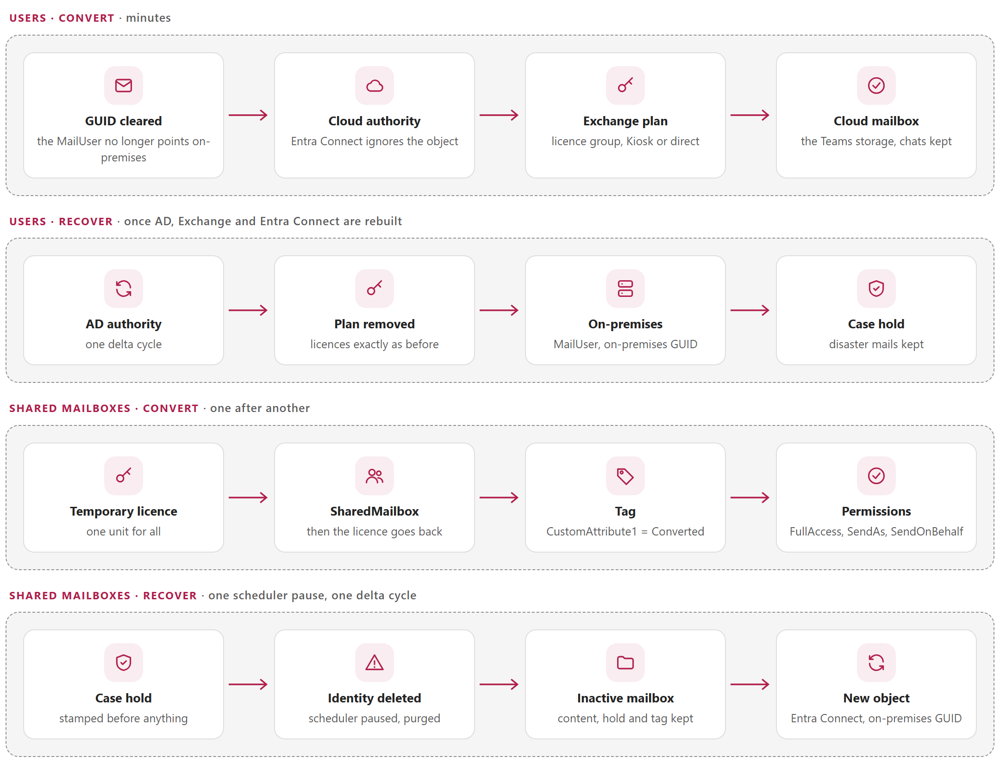
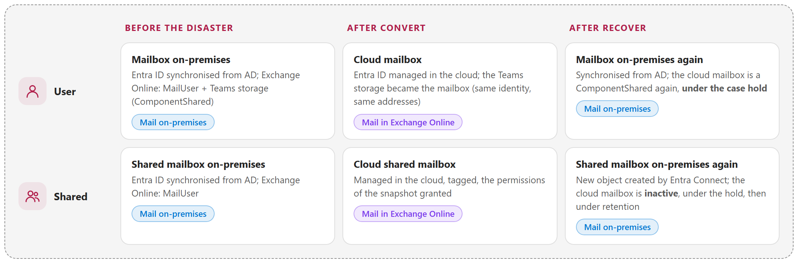
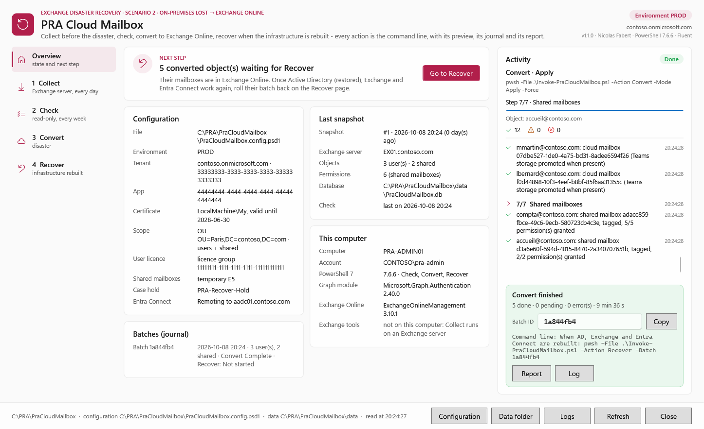
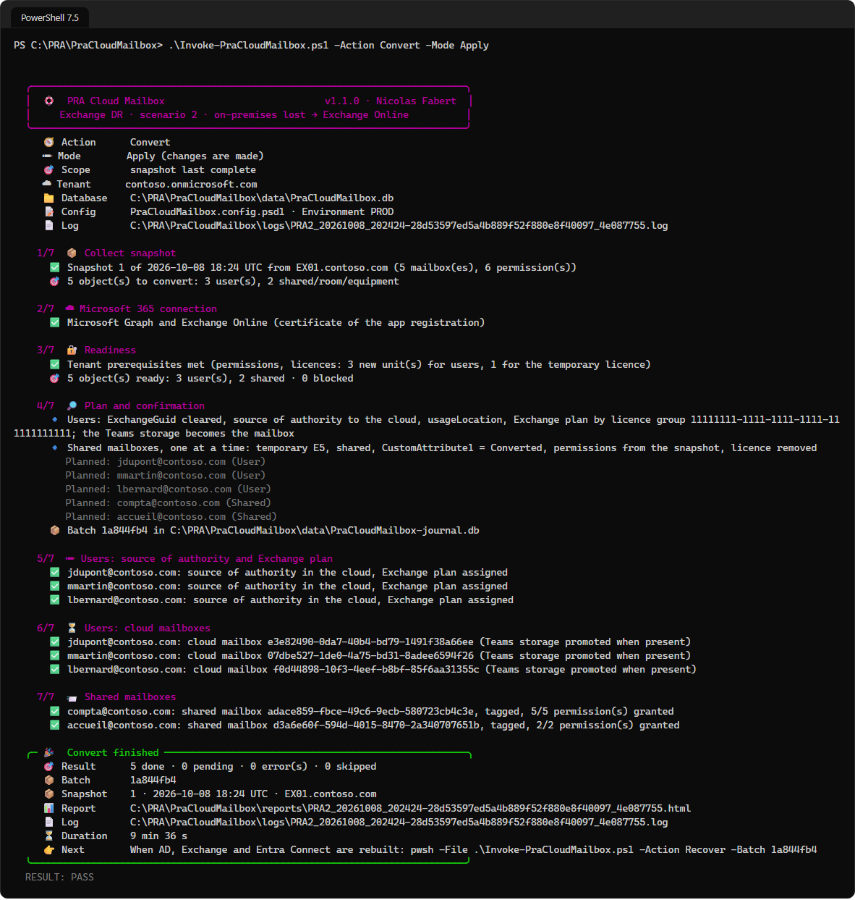
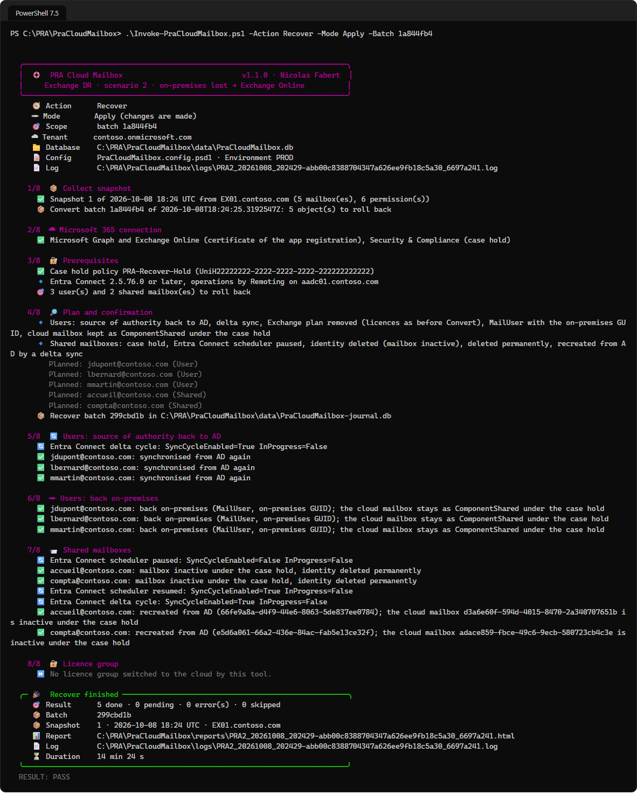
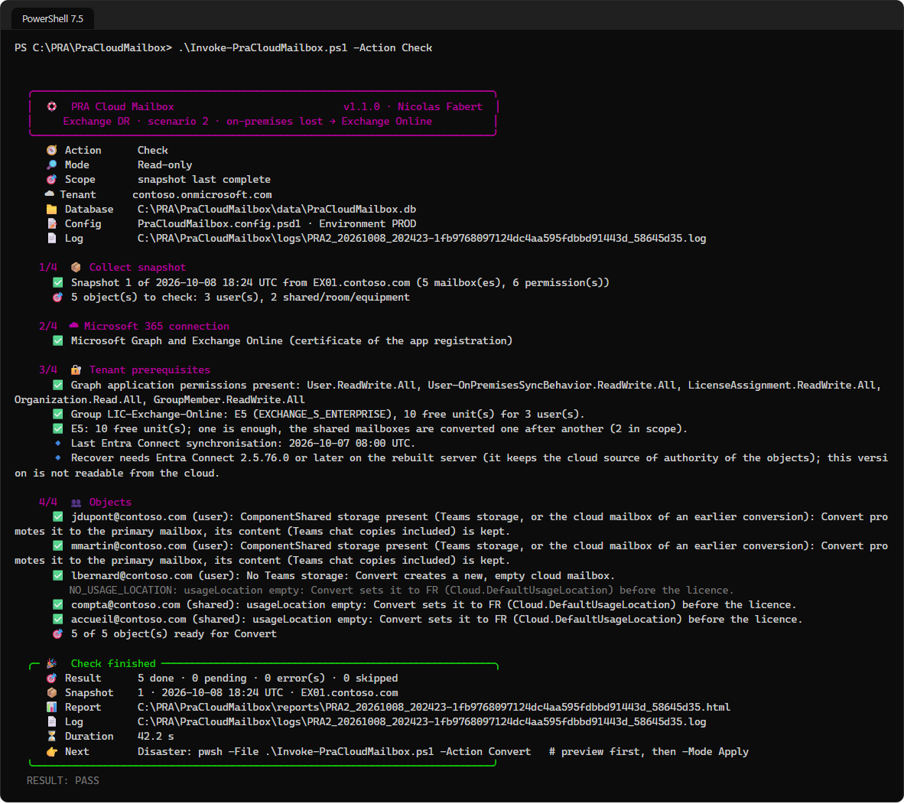
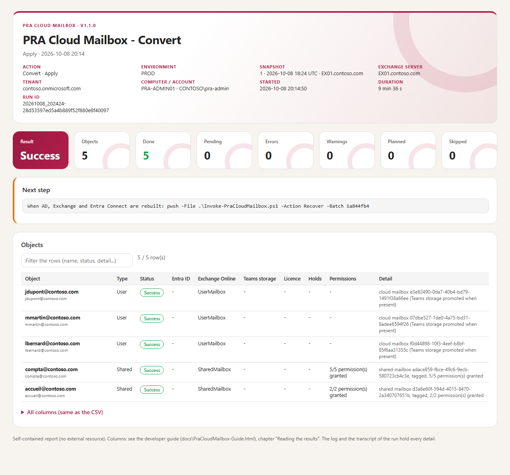

<p align="center">
  <picture>
    <source media="(prefers-color-scheme: dark)" srcset="docs/images/readme-banner-dark.png">
    
  </picture>
</p>

<p align="center">
  <a href="#why"><b>Why</b></a> &nbsp;&middot;&nbsp;
  <a href="#how-it-works"><b>How it works</b></a> &nbsp;&middot;&nbsp;
  <a href="#convert-and-recover"><b>Convert and Recover</b></a> &nbsp;&middot;&nbsp;
  <a href="#reports"><b>Reports</b></a> &nbsp;&middot;&nbsp;
  <a href="#quick-start"><b>Quick start</b></a> &nbsp;&middot;&nbsp;
  <a href="docs/PraCloudMailbox-UserGuide.md"><b>User guide</b></a> &nbsp;&middot;&nbsp;
  <a href="docs/PraCloudMailbox-Guide.md"><b>Developer guide</b></a>
</p>

> [!IMPORTANT]
> Files downloaded from the Internet may be blocked by Windows and fail to run. Before using this project, unblock every file in the downloaded folder:
>
> ```powershell
> Get-ChildItem "C:\Chemin\Du\Dossier" -Recurse -File -Force | Unblock-File
> ```
>
> Replace the example path with the folder where you downloaded or extracted this project.
>
> The `Install-Module` commands in this documentation use `-Force`, so they also update or reinstall a module that is already installed. If an older version still conflicts, close every PowerShell window, open a new one (as administrator for `-Scope AllUsers`), run `Uninstall-Module <ModuleName> -AllVersions -Force`, then run the `Install-Module` command again.

## Why

In a hybrid organisation, a mailbox hosted on-premises is only a *mail user* for Exchange Online. When **Active Directory, Exchange and Entra Connect** are lost at the same time — ransomware, loss of the site — the users can still sign in to Microsoft 365 and Teams still works, but nobody has a mailbox any more, and nothing can be written in AD to fix it. *PRA* stands for *Plan de Reprise d'Activité*, the disaster recovery plan; this is its **scenario 2** (scenario 1, Exchange servers lost with AD alive, is [PRA Remote Mailbox](https://github.com/Nico77600/PraRemoteMailbox)).

Done by hand, giving each user a cloud mailbox means changing the source of authority of every identity, licensing it in the right order, recreating the shared mailboxes with their permissions — which can no longer be read on-premises — and, months later, undoing all of it **without deleting the mails received in the cloud**. This tool collects what it needs before the disaster, then does the conversion and the rollback in the order validated in a lab, verified at each step and journaled.

<picture>
  <source media="(prefers-color-scheme: dark)" srcset="docs/images/readme-principles-dark.png">
  
</picture>

## How it works

<picture>
  <source media="(prefers-color-scheme: dark)" srcset="docs/images/readme-how-it-works-dark.png">
  
</picture>

- **Collected before.** `Collect` runs every day on an Exchange server (Windows PowerShell 5.1) and stores the mailboxes, their GUIDs and X500 addresses, and the **permissions of the shared mailboxes** (FullAccess with AutoMapping, SendAs, SendOnBehalf, groups expanded) in one SQLite file.
- **Same identity, Teams storage promoted.** `Convert` (PowerShell 7, certificate of an app registration) moves the source of authority of each identity to the cloud and gives it an Exchange plan: the **Teams storage of the user becomes his mailbox**, with his chats. Shared mailboxes are converted one after another with **one** temporary licence unit.
- **Preview by default, one batch ID.** Without `-Mode Apply` nothing is changed. Apply asks one confirmation, journals the original state of every object, and prints the batch ID with the exact next command.
- **Back without losing a mail.** `Recover -Batch <ID>` gives the identities back to AD; the users' cloud data stays under an **eDiscovery case hold**, the cloud shared mailboxes become **inactive mailboxes**, and every licence is put back exactly as it was.

## Convert and Recover

<picture>
  <source media="(prefers-color-scheme: dark)" srcset="docs/images/readme-flows-dark.png">
  
</picture>

The states of a mailbox through the cycle:

<picture>
  <source media="(prefers-color-scheme: dark)" srcset="docs/images/readme-states-dark.png">
  
</picture>

> [!CAUTION]
> Convert and Recover change production objects in Entra ID and Exchange Online. Every behaviour they rely on was measured in a lab (developer guide, appendix B): run the preview, read the plan, and test the whole cycle with your own tenant before relying on it in a real disaster.

## The window

<p align="center"><a href="docs/images/pra-gui-overview.png"></a></p>

`.\Invoke-PraCloudMailbox.ps1 -Gui` (Windows PowerShell 5.1 or PowerShell 7) opens the same four actions in a window: the next step at a glance, one table of objects per page (filter, waves of ticked objects), the activity of the run step by step. Each button runs the command line in its own PowerShell, with its log, journal and report; *Convert…* and *Recover…* are enabled only after a preview of the same selection, and ask for a typed confirmation.

## Reports

<table>
  <tr>
    <td width="50%" valign="top"><a href="docs/images/pra-console-convert.png"></a><br><sub><b>Convert</b> &middot; readiness, plan, users then shared mailboxes; summary card with the batch ID and the next command</sub></td>
    <td width="50%" valign="top"><a href="docs/images/pra-console-recover.png"></a><br><sub><b>Recover</b> &middot; users back on-premises under the case hold, shared mailboxes inactive and recreated by Entra Connect</sub></td>
  </tr>
  <tr>
    <td width="50%" valign="top"><a href="docs/images/pra-console-check.png"></a><br><sub><b>Check</b> &middot; read-only: tenant prerequisites, then whether each object is ready for Convert</sub></td>
    <td width="50%" valign="top"><a href="docs/images/pra-report-convert.png"></a><br><sub><b>HTML report</b> &middot; result, counters, next step, one row per object with its Entra ID, Exchange Online, licence, hold and permission status</sub></td>
  </tr>
</table>

Every run also writes a log, a PowerShell transcript and a CSV; Convert and Recover write the journal of the batch. Exit codes: 0 = done, 1 = failed (or an object is not ready), 2 = done, next step required.

## Requirements

| Item | Requirement |
|---|---|
| Scenario | Hybrid Exchange organisation synchronised by **Entra Connect**. After the disaster: AD restored from a backup (same objectGUID), Exchange, and Entra Connect **2.5.76.0** or later |
| Collect | An Exchange server (or the management tools), **Windows PowerShell 5.1**, an account that reads recipients and permissions. Nothing to install (SQLite is bundled) |
| Cloud actions | A cloud admin server that does not depend on the on-premises AD, **PowerShell 7.4+**, `Microsoft.Graph.Authentication` and `ExchangeOnlineManagement` 3.10+ |
| App registration | Certificate; Graph application permissions (users, source of authority, licences, organisation, group members); `Exchange.ManageAsApp` with Exchange Administrator; eDiscovery Manager in Microsoft Purview |
| Licences and holds | A licence group with an Exchange Online plan (or the Kiosk plan of the Teams licence, or direct licences), **one** free unit for the shared mailboxes, an eDiscovery case hold policy, a retention policy for the inactive shared mailboxes |
| Console | Windows Terminal for emoji and colours; the classic console shows symbols. The window: Windows 10/11 or Windows Server 2016+, Fluent theme with PowerShell 7.5+ |

## Quick start

```powershell
git clone https://github.com/Nico77600/PraCloudMailbox.git
cd PraCloudMailbox
notepad .\config\PraCloudMailbox.config.psd1        # scope, tenant, app registration, licences, case hold, Entra Connect

# Before the disaster - Exchange server, Windows PowerShell 5.1 (scheduled task, every day)
.\Invoke-PraCloudMailbox.ps1 -Action Collect                        # preview: what would be collected
.\Invoke-PraCloudMailbox.ps1 -Action Collect -Mode Apply -Force     # writes a snapshot to data\PraCloudMailbox.db

# Cloud admin server, PowerShell 7 - copy data\PraCloudMailbox.db there first
.\Invoke-PraCloudMailbox.ps1 -Action Check                          # read-only: is every object ready?
.\Invoke-PraCloudMailbox.ps1 -Action Convert                        # disaster: preview of the plan
.\Invoke-PraCloudMailbox.ps1 -Action Convert -Mode Apply            # prints the batch ID
.\Invoke-PraCloudMailbox.ps1 -Action Recover -Batch 5b21030d -Mode Apply    # infrastructure rebuilt: roll the batch back

# Or the window, on either computer
.\Invoke-PraCloudMailbox.ps1 -Gui
```

One command per moment — every day, every week, the disaster, the rollback, the days after: see the [user guide](docs/PraCloudMailbox-UserGuide.md). The environment values of the configuration are empty in this repository. The zip of each [release](https://github.com/Nico77600/PraCloudMailbox/releases) contains only the files needed to run, with both guides in HTML; `.\tools\New-PraCloudPackage.ps1` builds the same package from the repository.

## Documentation

| Guide | Content |
|---|---|
| **[User guide](docs/PraCloudMailbox-UserGuide.md)** | For the people who run the tool: **prerequisites** and **one command per moment** — collect every day, check every week, convert at the disaster, recover once the infrastructure is rebuilt, the days after — and how to read the results. |
| **[Developer guide](docs/PraCloudMailbox-Guide.md)** | Everything else: the scenario, the procedure validated in the lab and the states of a mailbox, the app registration, the case hold and the retention policy, the configuration in detail, each action step by step, the Check codes, the reports, the architecture, the databases, the tests, how to evolve the tool, troubleshooting and the lab results. |

Both guides also exist as a single HTML file with a light and a dark theme (`docs/PraCloudMailbox-UserGuide.html`, `docs/PraCloudMailbox-Guide.html`): download them and open them locally, or use the copies in the release zip.

## Tests

```powershell
# Pester 5+ and PSScriptAnalyzer; no Exchange, no tenant needed
powershell.exe -NoProfile -File .\tests\Invoke-TestGate.ps1     # Windows PowerShell 5.1: Collect, store, rules
pwsh -NoProfile -File .\tests\Invoke-TestGate.ps1               # PowerShell 7: everything, Convert and Recover end to end
```

The end-to-end tests run the real Convert and Recover code against an in-memory tenant that reproduces what the lab showed (Teams storage promoted, a hold that blocks the switch back, inactive mailbox when a held identity is deleted, deleted object restored by Entra Connect unless purged...), with faults to inject: order of the steps, resume, refusals, waves, stops and resumes, partial failures and the rollback of every state; the window is tested in both editions, with a real run in a child PowerShell. The tool was also validated on a lab of Exchange Server SE servers with Entra Connect and a Microsoft 365 E5 tenant — licence groups (cloud and synchronised), Kiosk and direct licences, shared mailboxes, waves, Entra Connect remoting (developer guide, appendix B).

## License

[MIT](LICENSE). Third-party components: [THIRD-PARTY-NOTICES.md](THIRD-PARTY-NOTICES.md) (System.Data.SQLite, public domain).

## Disclaimer

Personal project, provided as is. It is not an official Microsoft product and is not supported by Microsoft. The tool changes production objects in Entra ID and Exchange Online: run the preview, review the plan, keep the journal and test the whole cycle in a lab before using it in a real disaster.
