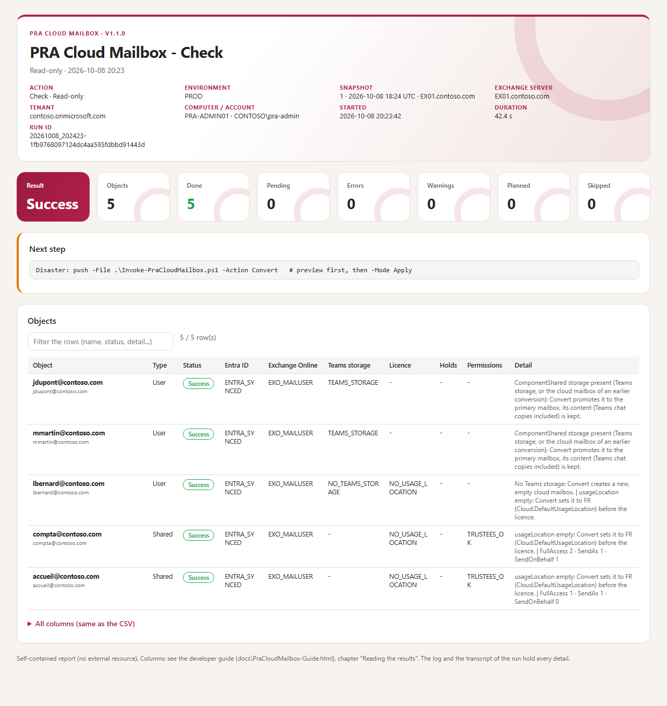
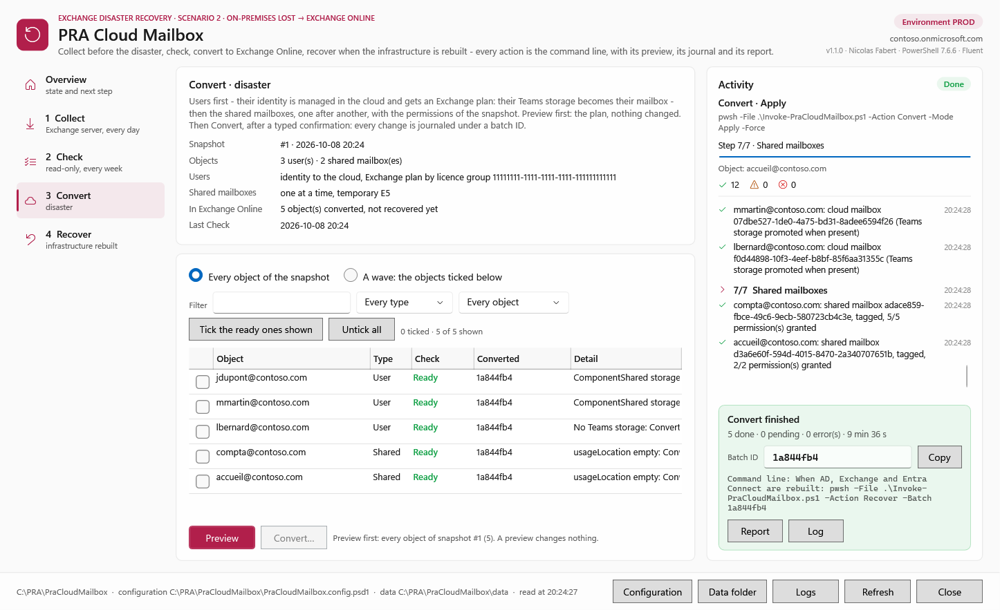

# PRA Cloud Mailbox — User guide

> What must be in place before the disaster, then one command per moment: **every day** (collect), **every week** (check), **the disaster** (convert), **the infrastructure is back** (recover) and **the days after**. Every command can also be run from a window (chapter 7). The procedure in detail, the prerequisites of the app registration, the configuration, the databases and the internals are in the [developer guide](PraCloudMailbox-Guide.md).

> [!IMPORTANT]
> Files downloaded from the Internet may be blocked by Windows and fail to run. Before using this project, unblock every file in the downloaded folder:
>
> ```powershell
> Get-ChildItem "C:\Chemin\Du\Dossier" -Recurse -File -Force | Unblock-File
> ```
>
> Replace the example path with the folder where you downloaded or extracted this project.

```cards
checklist | Prerequisites | Chapter 1: two computers, two editions of PowerShell, an app registration, the licences and the holds, then the one-time setup.
database | Before the disaster | Chapter 2: collect every day, check every week.
cloud | Disaster | Chapter 3: preview, convert, note the batch ID.
refresh | Infrastructure rebuilt | Chapters 4 and 5: roll the batch back, then what is left to do.
compare | The window | Chapter 7: the same commands from a window, with a preview before every change.
```

<!-- icon: checklist -->
## 1. Prerequisites

| Item | Requirement |
|---|---|
| Exchange side (Collect) | An Exchange server (or the management tools), **Windows PowerShell 5.1**, an account that reads recipients and permissions (*View-Only Organization Management* and *Active Directory Permissions*, or *Organization Management*) |
| Cloud admin server | A Windows computer that does **not depend on the on-premises AD**, **PowerShell 7.4** or later, the modules `Microsoft.Graph.Authentication` and `ExchangeOnlineManagement` 3.10+ |
| App registration | Certificate sign-in, Microsoft Graph application permissions, `Exchange.ManageAsApp` with the Exchange Administrator role, eDiscovery Manager in Microsoft Purview: [developer guide, chapter 4.3](PraCloudMailbox-Guide.md#43-app-registration) |
| Licences | A licence group with an Exchange Online plan and free units for the users (or the Kiosk plan of their Teams licence, or direct licences), and **one** free unit for the shared mailboxes |
| Holds | An eDiscovery case hold policy and a retention policy for the inactive shared mailboxes: [developer guide, chapter 4.4](PraCloudMailbox-Guide.md#44-case-hold-and-retention) |
| After the disaster | Active Directory restored from a backup (same objectGUID), Exchange, and **Entra Connect 2.5.76.0** or later |

### 1.1 One-time setup

```steps
Copy the tool | Download `PraCloudMailbox-<version>.zip` from the latest release, extract it to `C:\PRA\PraCloudMailbox` on the Exchange server and on the cloud admin server, and unblock the files.
Install the modules | On the cloud admin server, in an administrator PowerShell 7: `Install-Module Microsoft.Graph.Authentication -Scope AllUsers -Force` and `Install-Module ExchangeOnlineManagement -MinimumVersion 3.10.0 -Scope AllUsers -Force`.
Import the certificate | The certificate of the app registration, with its private key, in `Cert:\LocalMachine\My` of the cloud admin server.
Configure | `notepad .\config\PraCloudMailbox.config.psd1`: the scope (an OU, a group or a CSV list), the tenant, the app registration, the licence group, the temporary licence of the shared mailboxes, the case hold policy and the way to reach Entra Connect. Copy the same file to the other computer.
First collect | On the Exchange server: `.\Invoke-PraCloudMailbox.ps1 -Action Collect` (preview), then `-Mode Apply -Force`. Copy `data\PraCloudMailbox.db` to the cloud admin server.
First check | On the cloud admin server: `.\Invoke-PraCloudMailbox.ps1 -Action Check`. Fix every red line until all the objects are ready.
```

<!-- icon: database -->
## 2. Before the disaster

### 2.1 Every day: collect

A scheduled task on the Exchange server, under the collect account:

```powershell
powershell.exe -NoProfile -ExecutionPolicy Bypass -File C:\PRA\PraCloudMailbox\Invoke-PraCloudMailbox.ps1 -Action Collect -Mode Apply -Force
```

Then copy `data\PraCloudMailbox.db` (or the last file of `data\backup`) to the cloud admin server, for example with a second task. **After the disaster nothing on-premises can be read**: the last copy is what the tool knows about the mailboxes and the permissions of the shared mailboxes.

### 2.2 Every week: check

```powershell
.\Invoke-PraCloudMailbox.ps1 -Action Check                          # every object of the last snapshot
.\Invoke-PraCloudMailbox.ps1 -Action Check -Identity compta@contoso.com
```

Read-only. Every object must be green: an object in error would be refused by Convert. Typical fixes: a free licence unit, a missing Graph permission, an Exchange Online plan already enabled on a user (`EXCHANGE_PLAN_PRESENT`), a user without country (`NO_USAGE_LOCATION`), an organisation-wide retention policy (`ORG_HOLD`). Check also warns when the last snapshot is too old.


<!-- icon: cloud -->
## 3. Disaster: convert

AD, Exchange and Entra Connect are lost. On the cloud admin server, in PowerShell 7:

```powershell
.\Invoke-PraCloudMailbox.ps1 -Action Convert                         # preview: the plan, nothing is changed
.\Invoke-PraCloudMailbox.ps1 -Action Convert -Mode Apply             # one confirmation, then the batch
```

- The users get their mailbox first (their Teams storage becomes their mailbox, in one or two minutes), then the shared mailboxes, one after another, with their permissions.
- **Note the batch ID** printed in the final card: it is the only input of the rollback. It is also in the report and in the journal.
- A user still *Pending* at the end: run the same command with `-Batch <ID>` a little later; only what is not finished is taken again.
- One part only: `-Scope UsersOnly` or `-Scope SharedOnly`; one object: `-Identity compta@contoso.com`; a wave: `-IdentityPath .\wave1.txt` (one identity per line, or a CSV file with an `Identity` column). Each Convert is a batch of its own.


<!-- icon: refresh -->
## 4. Infrastructure rebuilt: recover

AD (restored from a backup), Exchange and Entra Connect work again. On the cloud admin server:

```powershell
.\Invoke-PraCloudMailbox.ps1 -Action Recover -Batch 5b21030d                   # preview
.\Invoke-PraCloudMailbox.ps1 -Action Recover -Batch 5b21030d -Mode Apply       # roll the batch back
```

- **Users**: they are synchronised from AD again and their mail goes back to their on-premises mailbox. Their cloud mailbox — with the mails received during the disaster — stays in Microsoft 365 under the eDiscovery case hold.
- **Shared mailboxes**: their cloud mailbox becomes an **inactive mailbox** under the case hold (nothing is lost), and Entra Connect creates a new object linked to the on-premises shared mailbox.
- Something not finished (*Pending*, or an error fixed in the meantime): run the same command again.
- Several Convert batches: roll each one back with its own ID. A batch can also go back in waves: `-Batch 5b21030d -IdentityPath .\wave1.txt`, then the rest with the same `-Batch`.


<!-- icon: shield -->
## 5. The days after

| What | How |
|---|---|
| Find a mail received during the disaster | eDiscovery search on the user (his cloud storage) or on the inactive shared mailbox |
| Inactive shared mailboxes | After a few days the retention policy holds them too (`Get-Mailbox -InactiveMailboxOnly`, `InPlaceHolds`); their entry in the case hold policy can then be removed — never before |
| Keep the records | `data\PraCloudMailbox-journal.db`, `logs\` and `reports\`: what was changed, when, by whom |
| Collect again | Once Exchange is back, the daily collect starts again for the next disaster |

<!-- icon: file -->
## 6. Results

Every run prints a banner, numbered steps and a summary card with the result, the batch ID, the report, the log, the duration and the next command.

| File | Content |
|---|---|
| `reports\PRA2_<date>_<run>.html` | the report: result, counters, next step, one row per object (filter box) |
| `reports\PRA2_<date>_<run>.csv` | the same rows, for Excel |
| `logs\PRA2_<date>_<run>.log` | every step with its time; last line `RESULT: PASS` or `RESULT: FAIL` |
| `logs\PRA2_<date>_<run>.transcript.txt` | the PowerShell transcript |



| Exit code | Meaning |
|---|---|
| `0` | done |
| `1` | failed, or (Check) an object is not ready |
| `2` | done, next step required: an object is *Pending*, run the same command again later |

Something unexpected: [developer guide, appendix A - Troubleshooting](PraCloudMailbox-Guide.md#appendix-a---troubleshooting).

<!-- icon: compare -->
## 7. The window

```powershell
pwsh -File .\Invoke-PraCloudMailbox.ps1 -Gui              # cloud admin server, PowerShell 7
powershell.exe -File .\Invoke-PraCloudMailbox.ps1 -Gui    # Exchange server, Windows PowerShell 5.1
```

The window changes nothing by itself: each button runs the command of this guide in its own PowerShell — Windows PowerShell 5.1 for Collect, PowerShell 7 for the others — with the same log, transcript, journal and report. The **Activity** panel follows the run step by step, then shows its result, the batch ID, the next step, the report and the log.


| Page | What it shows | What it runs |
|---|---|---|
| Overview | The next step, the configuration (certificate found, valid until), the last snapshot and Check, the batches, this computer (PowerShell 7, modules) | The button of the next step |
| 1 Collect | The scheduled task to copy, the snapshots of the database | Preview, *Collect now* (after a yes) |
| 2 Check | The counters and one row per object of the last Check; filter by text, status and type | Check: every object, the users or the shared mailboxes |
| 3 Convert | Every object of the snapshot with its last Check and its last batch | Preview, then *Convert…* |
| 4 Recover | The Convert batches, then the objects of the batch chosen | Preview, then *Recover…* |

```steps
Preview | *Convert…* and *Recover…* stay disabled until a preview has run on **exactly** the same selection: same snapshot or batch, same objects ticked. Any change asks for a new preview.
Confirm | Type `CONVERT` or `RECOVER`: the dialog shows the objects and the command line that will run.
Waves | Tick the objects of a wave — or filter, then *Tick the ready ones shown*. The window writes the list to `data\gui\wave-<action>-<time>.csv` and runs the command with `-IdentityPath`: the log names the file.
Stop | *Stop after the current object*: no new object is started and the run ends normally (journal, report). *Preview the resume* (Convert) or Recover again takes up what is left.
```

- With Entra Connect in *Manual* mode, the run asks its questions in a Yes / No dialog (run the synchronisation, then answer).
- The window cannot be closed while a run is going.
- The files of each run are in `data\gui` (`run-*.events.jsonl`, the output of the PowerShell); they are deleted after 30 days, the wave lists are kept.


